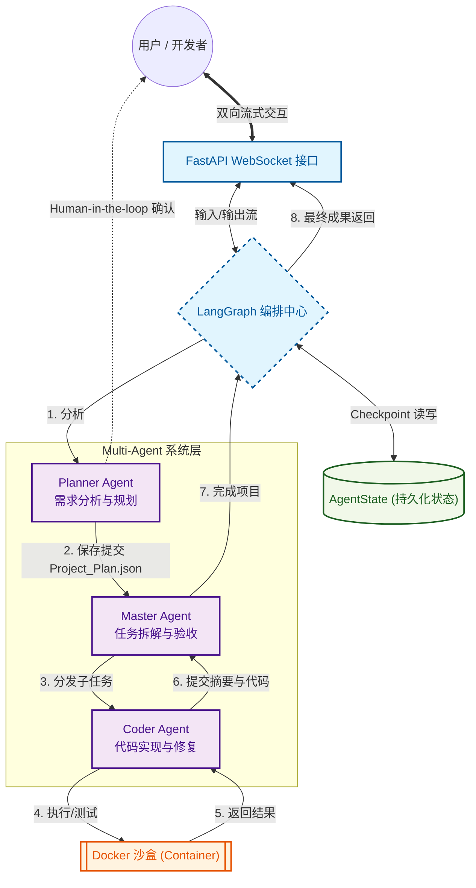

## EasyProWeb 🚀
EasyProWeb 是一款基于 LangGraph 构建的Agent软件开发网站。它采用分层式多智能体协同机制，旨在将复杂的自然语言需求转化为稳定、安全且可验证的工业级代码成果。
### 🌟 核心特性
* 🧠 **分层式多智能体架构 (Hierarchical Multi-Agent)**：

  * Planner: 需求分析与蓝图制定，通过 Human-in-the-loop 机制确保需求对齐。

  * Master: 任务拆解、动态编排与验收，实现 60% 的全局状态 Token 压缩。

  * Coder: 闭环式代码开发，集成“编写-测试-修复”的自愈逻辑。

* 🛡️ **安全执行沙盒 (Docker Sandbox)**：为每个用户会话维持长驻容器，实现网络隔离（Network-less）与资源限额，保护宿主机安全。

* ⚡ **高性能流式交互**：基于异步 FastAPI 与 WebSocket 实现全链路流式日志输出，实时感知 Agent 思考过程。

* 💾 **多级持久化方案**：集成 LangGraph Checkpointer，支持线程级状态恢复与文件系统级成果持久化，无惧意外中断。

* 🛠️ **推理优化方案**：支持合成工具注入以消除冷启动延迟，提供增量编辑工具（Search-and-Replace），大幅降低输出 Token 成本。
### 🏗️ 架构概览



### 📂 项目结构
```
backend/
├── app/                  # 核心源代码包
│   ├── __init__.py
│   ├── main.py           # main文件
│   ├── api/              # 接口层 (WebSocket/REST)
│   ├── graph/            # 编排层 (LangGraph 逻辑)
│   │   ├── prompts/      # Prompt 模版
│   │   ├── nodes/        # 节点函数
│   │   └── state/        # 状态定义
│   ├── tools/            # 能力层 (Agent 调用的工具)
│   └── utils/            # 系统层 (Docker/File 通用工具)
├── workspaces            # 隔离的用户代码区
├── tests/                # 测试代码
├── .env                  # 环境变量
└── README.md             
```